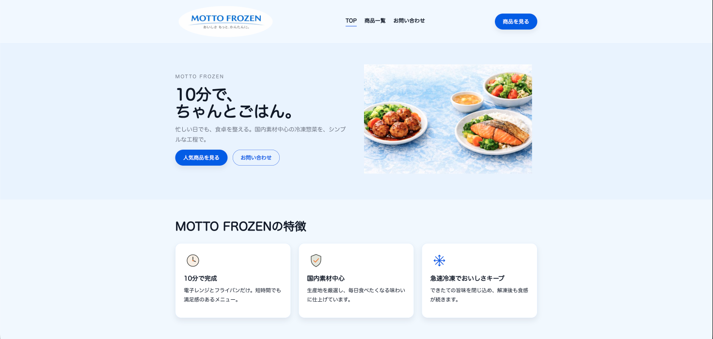
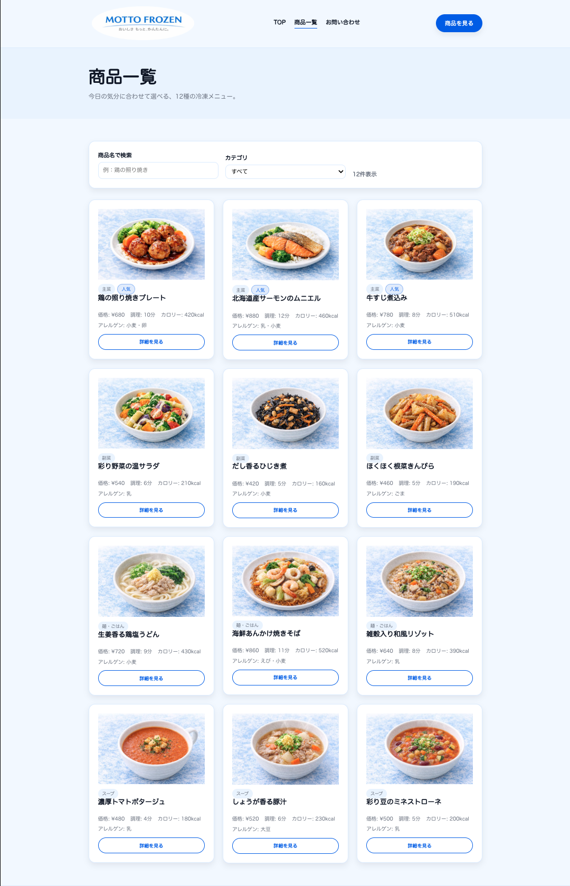
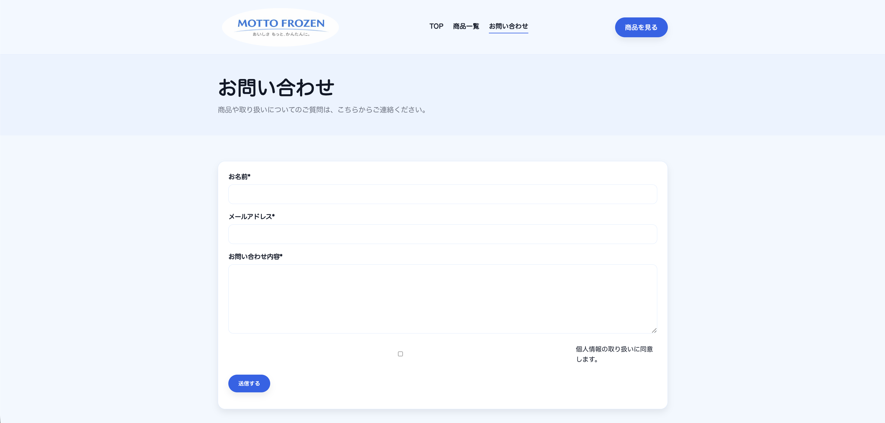
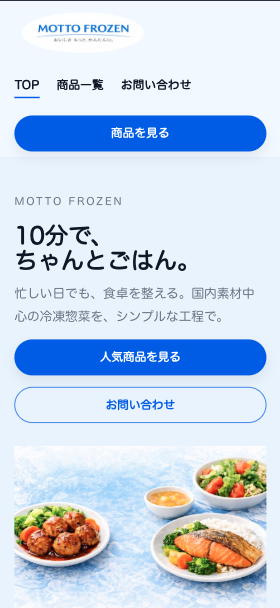

# Frozen Food Brand Website

架空の冷凍食品ブランド「MOTTO FROZEN」のWebサイト制作ポートフォリオです。  
**清潔感のある淡い水色トーン**で、商品が見やすいUIを意識して制作しました。  
（レスポンシブ対応 / 3ページ構成）

## Demo
- GitHub Pages：https://aoiishikawa1818.github.io/frozen-food-brand-website/

## Screenshots（画面）
| TOP | 商品一覧 | お問い合わせ | スマホ表示 |
| --- | --- | --- |
|  |  |  |  |

---

## Pages
- TOP（`index.html`）：ブランド訴求 / 人気商品への導線
- 商品一覧（`products.html`）：商品カード一覧 / 人気バッジ表示
- お問い合わせ（`contact.html`）：入力フォーム

## Features
- **商品データ（JSON）からカードを動的生成**（画像・価格・調理時間・カロリー・アレルゲン等）
- **人気商品バッジ表示**（人気商品3点を強調）
- 画像最適化（`assets/foods/` に商品画像を配置）
- レスポンシブ対応（スマホでも3カラム→1カラムに崩れない設計）

---

## Structure
├── index.html
├── products.html
├── contact.html
├── styles.css
├── script.js
├── data
│ └── products.json
└── assets
└── foods
└── *.png

## How to run (Local)
> 静的サイトのため、ローカルサーバーで起動すると確認しやすいです。
例：Python
```bash
python3 -m http.server 8000
```
ブラウザで開く：http://localhost:8000/

---

## Tech
- HTML / CSS / JavaScript

## Notes
- 画像・文章・ブランド名はポートフォリオ用の架空コンテンツです。